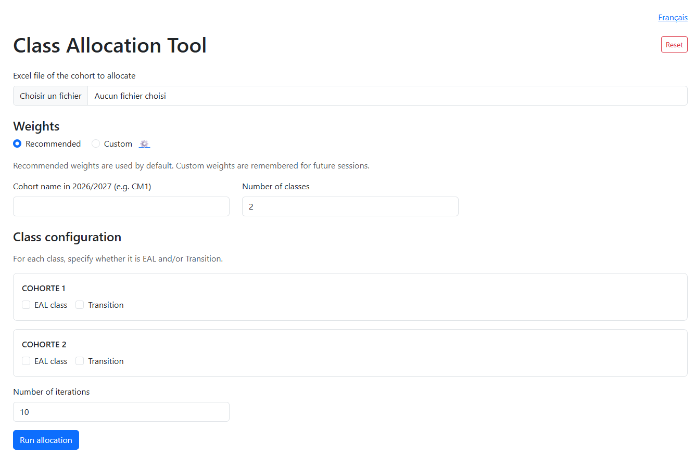
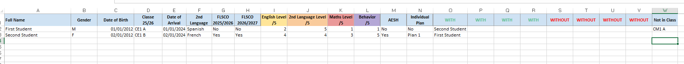
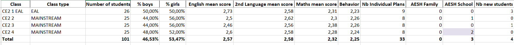
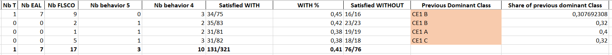

<a href="https://vinsl.github.io/class-allocation-tool/" target="_blank">Portfolio</a>

# Class Allocation Tool
A school class-allocation system that transforms cohort data into balanced,
constraint-aware class assignments for primary education.

> Portfolio case study: the original implementation and school data are proprietary.
> This repository contains documentation, anonymised examples and a rewritten technical demonstration.

## Problem

Assigning students to classes is a multi-criteria decision problem.

A school must balance academic levels, behaviour, gender distribution,
language-support requirements, individual learning plans, social relationships
and operational constraints while still producing a usable result for school leadership.

Manual allocation is time-consuming, generally unofficially relying on teachers' paid time, and difficult to reproduce consistently.

## My solution

The tool provides a browser-based workflow that allows authorised staff to:

1. Upload a cohort spreadsheet.
2. Validate the detected student population.
3. Configure the target number and type of classes.
4. Use recommended or custom optimisation weights.
5. Run the allocation process.
6. Monitor progress and intermediate scores.
7. Download the resulting Excel workbook for review and manual adjustment.

This tool can be directly implemented on the school's internal server
to ensure data protection and resilience.

## Product walkthrough

### Class Allocation GUI :

### Video Walkthrough on making a class allocation :

### Example of input :

### Example of output of a completed input:

## Technical documentation

- [Technical overview](docs/technical-overview.md)
- [Allocation algorithm](docs/allocation-algorithm.md)
- [Parameters and weights](docs/parameters-and-weights.md)

## Brochure for schools

- [Marketing one-page](https://vinsl.github.io/class-allocation-tool)

## Project status

- Original system: deployed in a real school environment.
- Public repository: documentation, screenshots and marketing material.
- Production source code: not included.
- Demo data: fully synthetic (screenshots use anonymised data).

## Contact

- Email: vincentselucas@gmail.com
- LinkedIn: [https://www.linkedin.com/in/vincent-lucas-483b29295/](...)